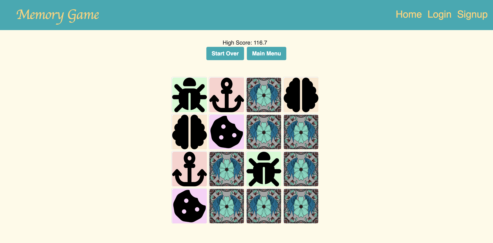

# Memory Game Group Project

## Table of Contents

* [Description](#description)
* [Technologies](#technologies)
* [Visuals](#visuals)
* [Application](#application)

## Description

This app is a  simple matching card game to occupy your time - using react as a single page application with a stylized layout. The main focus was to build a globally state managed matching game using the MERN stack.

## Technologies

* MongoDB
* Express
* React
* Node.js
* JSON Web Token
* Bootstrap
* Styled Components
* Heroku

## Visuals

## Application

Heroku Link: https://dry-tundra-29489.herokuapp.com/